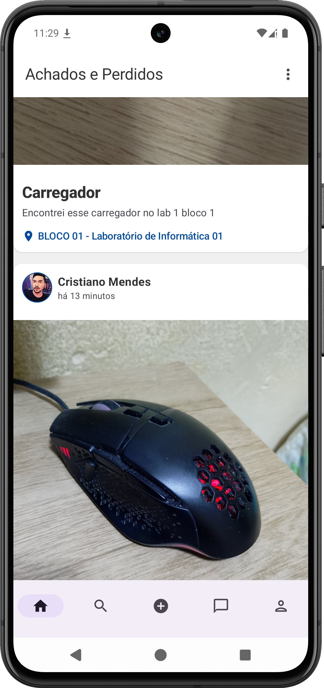

# Achados e Perdidos UFC

    
    

## Aplicativo Android

O aplicativo Android permite que usuários cadastrem, consultem e atualizem itens perdidos e encontrados diretamente pelo celular. Ele se comunica com o servidor via API RESTful, oferecendo uma interface amigável e notificações sobre atualizações de itens.

**Tecnologias utilizadas:**
- **Kotlin** para desenvolvimento nativo Android
- **Jetpack Compose** para construção da interface de usuário
- **Retrofit** para comunicação com a API RESTful
- **Koin** para regenciamento de dependencias

## Servidor Backend

O backend utiliza Node.js com o framework NestJS e PostgreSQL. Ele fornece uma API RESTful para cadastro, consulta, atualização e remoção de itens perdidos e encontrados, garantindo segurança e escalabilidade para o sistema.

**Tecnologias utilizadas:**
- **Node.js** como ambiente de execução
- **NestJS** como framework principal
- **PostgreSQL** como banco de dados relacional
- **JWT** para autenticação e segurança
